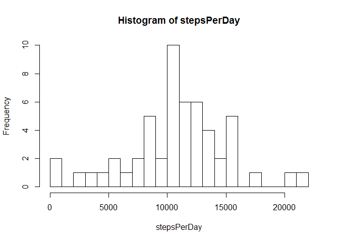
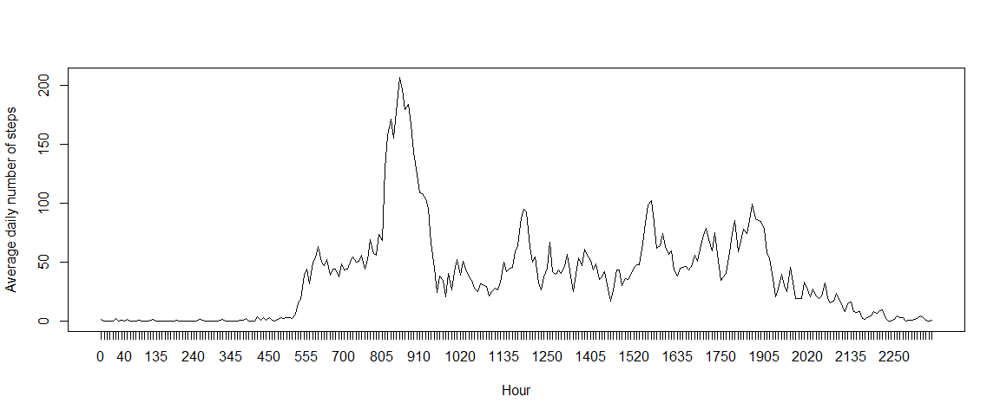
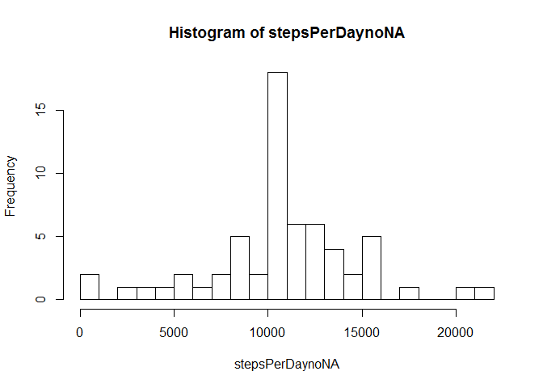
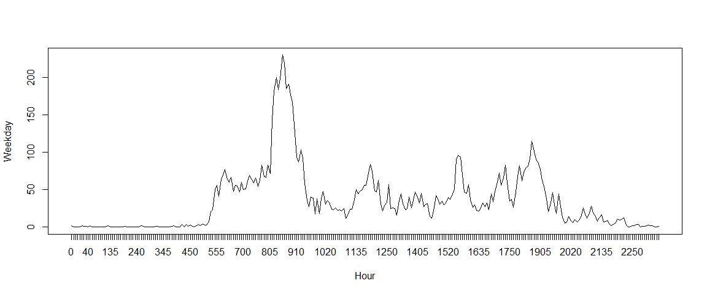
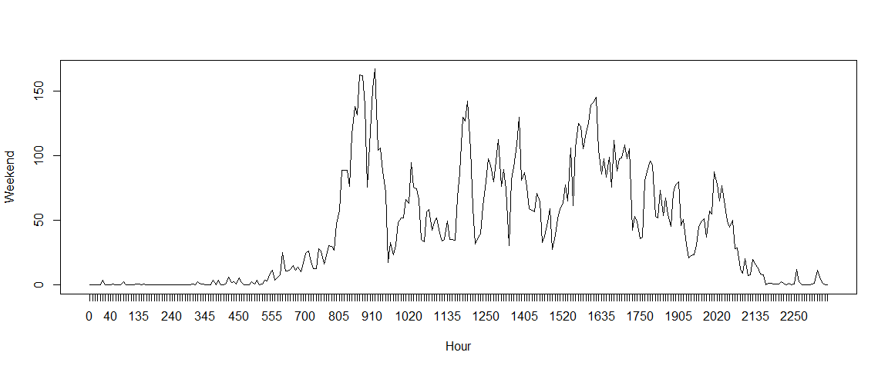

# Reproducible Research: Peer Assessment 1


## Loading and preprocessing the data

Before loading the file, I have set the working directory to where the data and the markdown file are saved. 

Load the file:


```r
act <- read.csv("activity.csv", header = TRUE, sep = ",");
typeof(act);
```

```
## [1] "list"
```

```r
head(act);
```

```
##   steps       date interval
## 1    NA 2012-10-01        0
## 2    NA 2012-10-01        5
## 3    NA 2012-10-01       10
## 4    NA 2012-10-01       15
## 5    NA 2012-10-01       20
## 6    NA 2012-10-01       25
```

One column is added to `act', with the intervals as factors (the *date* column is already as factor). These factors are used later to sum and average the data as required by the assignment.

```r
act <- cbind(act, intervalAsFactors = as.factor(act$interval));
head(act);
```

```
##   steps       date interval intervalAsFactors
## 1    NA 2012-10-01        0                 0
## 2    NA 2012-10-01        5                 5
## 3    NA 2012-10-01       10                10
## 4    NA 2012-10-01       15                15
## 5    NA 2012-10-01       20                20
## 6    NA 2012-10-01       25                25
```

## What is mean total number of steps taken per day?

To compute first the total number of steps per day I use the **tapply()** function. Note that the *NA* values are not removed in this step.


```r
stepsPerDay <- tapply(act$steps, act$date, sum);
head(stepsPerDay);
```

```
## 2012-10-01 2012-10-02 2012-10-03 2012-10-04 2012-10-05 2012-10-06 
##         NA        126      11352      12116      13294      15420
```

```r
hist(stepsPerDay, breaks=16);
```

 

The mean number of steps per day is:

```r
mean(stepsPerDay, na.rm = TRUE)
```

```
## [1] 10766.19
```

And the median number of steps per day is:

```r
median(stepsPerDay, na.rm = TRUE)
```

```
## [1] 10765
```

## What is the average daily activity pattern?

Use the same **tapply()** function, but this time remove the *NA* values, otherwise the *mean* computation is non-sensical.

```r
avgDailyPattern <- tapply(act$steps, act$intervalAsFactors, mean, na.rm = TRUE)
```
Plot the thing out:

```r
plot(avgDailyPattern, xaxt="n", xlab="Hour", ylab="Average daily number of steps", type = "l")
axis(1, at=1:288, labels = names(avgDailyPattern))
```

 

The hour with the maxium number of steps (on average over all days) is 835:

```r
head(sort(avgDailyPattern, decreasing=TRUE),1)
```

```
##      835 
## 206.1698
```

## Inputing missing values

The total number of missing values is:

```r
sum(is.na(act$steps))
```

```
## [1] 2304
```

To fill the missing data for the 5 minutes intervals I use the mean of the 5 minutes intervals over the 60+ days. The mean is extracted from the *avgDailyPattern* computed earlier. The new data set is called *actNoNAs*.


```r
actNoNAs <- act
for(i in 1:nrow(actNoNAs)){
  if(is.na(actNoNAs[i,]$steps)){
    actNoNAs[i,]$steps <- avgDailyPattern[actNoNAs[i,]$intervalAsFactor]
  }
}
```

And the number of missing values in the data is now: 0.

```r
sum(is.na(actNoNAs$steps))
```

```
## [1] 0
```

Plot the histogram for the total number of steps taken each day using the new data set, compute the mean and the median.


```r
stepsPerDaynoNA <- tapply(actNoNAs$steps, actNoNAs$date, sum);
head(stepsPerDaynoNA);
```

```
## 2012-10-01 2012-10-02 2012-10-03 2012-10-04 2012-10-05 2012-10-06 
##   10766.19     126.00   11352.00   12116.00   13294.00   15420.00
```

```r
hist(stepsPerDaynoNA, breaks=16);
```

 

The previous computed mean was 1.0766189\times 10^{4}. The new mean number of steps per day is:

```r
mean(stepsPerDaynoNA, na.rm = TRUE)
```

```
## [1] 10766.19
```

The previous computed median was 10765. And the new median number of steps per day is:

```r
median(stepsPerDaynoNA, na.rm = TRUE)
```

```
## [1] 10766.19
```

Comparing the two means and the two medians, we observe that the mean value didn't change, which was to be expected since we added mean values to the data.

The median differs slightly because data was added at different positions compared to the previous middle of the data.


## Are there differences in activity patterns between weekdays and weekends?

To the data set where NAs were filled with median data, we add the new factor variable based on the *data* column. Then compute two sets of minute interval averages: one for weekdays, one for weekends. Then plot them.


```r
actNoNAs <- cbind(actNoNAs, day = as.factor(ifelse(weekdays(as.Date(actNoNAs$date)) %in% c("Saturday", "Sunday"),"weekend", "weekday")))
stepsPerWeekday <- tapply(subset(actNoNAs, day == "weekday")$steps, subset(actNoNAs, day == "weekday")$interval, mean);
stepsPerWeekend <- tapply(subset(actNoNAs, day == "weekend")$steps, subset(actNoNAs, day == "weekend")$interval, mean);
```


```r
plot(stepsPerWeekday, xaxt = "n", xlab = "Hour", ylab = "Weekday", type = "l")
axis(1, at=1:288, labels = names(stepsPerWeekday))
```

 

```r
plot(stepsPerWeekend, xaxt = "n", xlab = "Hour", ylab = "Weekend", type = "l")
axis(1, at=1:288, labels = names(stepsPerWeekend))
```

 

